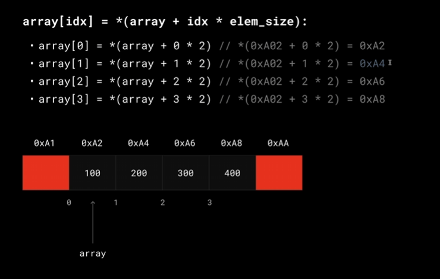

- ### acceess by index

When you pass an array to a function in Go, the entire array is copied — which consumes time and memory. To avoid copying, use slices (which are reference types) or pass a pointer to the array